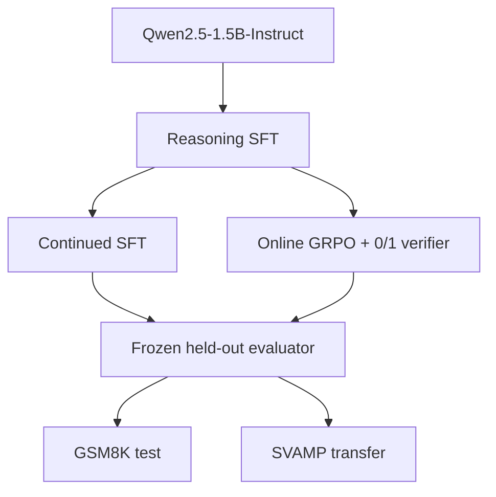

# Compute-Matched Verifier-Guided LLM Post-Training

**Question:** under a comparable additional GPU-time budget, does verifier-guided RL improve held-out mathematical reasoning more than continued supervised fine-tuning?

> Status: formal single-seed experiment complete on one NVIDIA H100 80 GB. Results below are generated from the checked-in evaluation summaries; no smoke-test metric is promoted as a final result.



## Main result

| Model | GSM8K exact match | SVAMP exact match | Extra GPU time |
|---|---:|---:|---:|
| Base | 66.945% | 81.667% | — |
| Reasoning SFT | 47.915% | 63.333% | — |
| Continued SFT | 48.446% | 58.667% | 1.380 GPU-h |
| GRPO / RLVR | **55.572%** | **64.000%** | 1.379 GPU-h |

Relative to the shared SFT checkpoint, GRPO recovered **+7.657 percentage points** on GSM8K. Under a 0.042% mismatch in additional GPU-hours, it beat continued SFT by **+7.127 points** on GSM8K (paired 95% CI [+4.321, +10.083], exact McNemar p=2.52e-6). The **+5.333-point** SVAMP advantage over continued SFT is directionally positive but not conclusive at this sample size (paired 95% CI [-0.333, +11.333]).

The base model remained stronger than every post-trained checkpoint. Reasoning SFT reduced accuracy by 19.030 points on GSM8K and 18.333 points on SVAMP; GRPO recovered part, but not all, of that regression. The result therefore supports a narrow claim—verifier-guided RL was more effective than equal-time continued SFT after this SFT checkpoint—not a claim that the full recipe improved the upstream model.

Generated sources: `results/evaluation/*.json`, `results/analysis/comparison_statistics.json`, and the two branch `run_metadata.json` files.


## Paired held-out comparisons

| Comparison | Benchmark | Accuracy delta | Paired 95% CI | McNemar exact p |
|---|---|---:|---:|---:|
| GRPO vs SFT | GSM8K | +7.657 pp | [+5.080, +10.159] | 5.29e-9 |
| GRPO vs SFT | SVAMP | +0.667 pp | [-4.333, +5.333] | 0.894 |
| GRPO vs continued SFT | GSM8K | +7.127 pp | [+4.321, +10.083] | 2.52e-6 |
| GRPO vs continued SFT | SVAMP | +5.333 pp | [-0.333, +11.333] | 0.0929 |

Intervals use 10,000 deterministic paired bootstrap resamples. The exact McNemar test uses the same per-example predictions.

## Why this experiment

An RL improvement can be misleading if the baseline simply received less post-training. This project first creates one reasoning-SFT checkpoint, hashes it, then loads that exact adapter independently into two branches:

- Continued SFT uses the same supervised objective.
- GRPO samples four online completions per prompt and receives only a binary, automatically verified final-answer reward.

The control variable is measured additional GPU time. GRPO runs to a predetermined cap; continued SFT reads GRPO's real `training_gpu_hours` and stops after the closest completed optimizer step. The report uses “comparable additional GPU time,” not exact equality, unless the recorded values justify stronger language.

## Quick start

The supported environment is Python 3.10–3.12 on one NVIDIA H100 80 GB or A100 80 GB.

```bash
git clone <your-repository-url>
cd rlvr-posttraining
bash scripts/setup.sh
bash scripts/smoke_test.sh
```

The smoke test uses 20 SFT examples, 10 RL prompts, ten GRPO optimizer steps, and 10 examples per evaluation benchmark. The longer smoke rollout budget reduces zero-signal batches while keeping the test short. It fails unless GRPO changes at least one actual LoRA tensor.

## Formal run

Commit the exact code/config state before starting. The complete formal pipeline is:

```bash
bash scripts/formal_run.sh
```

The script prepares frozen data, records the base checkpoint, trains SFT, runs GRPO, time-matches continued SFT, evaluates all branches, and generates every reported analysis. Individual stage scripts remain available for controlled recovery and debugging.

The pre-evaluation gate records the unmodified model before any substantial training. Do not replace GSM8K or SVAMP after observing post-training outcomes. If the base model leaves little GSM8K headroom, report that limitation and retain the frozen transfer benchmark.

## Data and split integrity

- SFT, RL prompts, and validation examples are disjoint deterministic subsets of `openai/gsm8k` train.
- `data/processed/splits.json` stores the source indices, seed, dataset ID, and optional revision.
- The official GSM8K test split is evaluation-only.
- SVAMP is evaluation-only.

Default train allocation:

| Use | GSM8K train examples |
|---|---:|
| Reasoning SFT | 3,000 |
| GRPO prompts | 1,000 |
| Validation | 500 |

## Stage 1: reasoning SFT

The Qwen adapter is trained on a conversational prompt–completion dataset containing the GSM8K reasoning solution and marked final answer. TRL computes loss only on completion tokens. LoRA targets attention and MLP projections; all important settings are explicit in `configs/sft.yaml`.

Outputs include the adapter, tokenizer reference, copied YAML, Trainer logs, wall-clock time, GPU-hours, peak VRAM, hardware, git state, and checkpoint hash.

## Stage 2A: continued-SFT control

`src.training.continued_sft` loads `checkpoints/sft` with `is_trainable=True`; it never initializes from the GRPO branch. Its wall-clock callback derives the target duration from `results/grpo/run_metadata.json`. The final metadata retains the source checkpoint hash so branch provenance can be audited.

## Stage 2B: GRPO / RLVR

For every training prompt, the policy samples four completions. `extract_final_answer` handles `####`, `\boxed{}`, answer phrases, integers, negatives, decimals, fractions, and comma separators. Exact rational normalization prevents float-rounding comparisons.

The primary and only reward is:

\[
r(y, y^*) = \mathbf{1}[\operatorname{normalize}(y)=\operatorname{normalize}(y^*)].
\]

The config explicitly selects the original `loss_type: grpo`; this avoids silently inheriting TRL 1.11.0's newer DAPO default. It also freezes group reward scaling, clipping, sampling temperature, maximum completion length, and generation count. `beta` is explicitly `0.0`: this follows the common reference-free TRL regime, avoids comparing the updated SFT adapter against the wrong base-model reference, and means KL is not claimed or plotted.

Every reward call writes:

- raw completion and ground truth;
- parsed prediction and normalized target;
- binary verifier result;
- reward mean and standard deviation;
- all-wrong, mixed, and all-correct group counts.

Mixed groups are especially important because an all-equal group provides no within-group relative advantage.

## Evaluation

All four checkpoints use the same greedy decoder, prompt, answer parser, and exact-match metric. Raw example-level generations are written before aggregate summaries. The summary includes a deterministic bootstrap 95% interval, completion length, decoding settings, hardware, and a pointer to the raw JSONL.

`checkpoint_sweep.py` evaluates saved branch checkpoints on the same fixed first 200 GSM8K test items and maps each checkpoint to the elapsed GPU time recorded in the training log. The main result table always uses the complete official test split, not this smaller diagnostic subset.

## Required analyses

`bash scripts/analyze.sh` produces:

- `figures/performance_vs_gpu_time.png`;
- `figures/grpo_reward_curve.png`;
- `figures/reward_group_composition.png`;
- compute accounting in `results/analysis/compute_table.md`;
- paired bootstrap intervals and exact McNemar tests in `results/analysis/comparison_statistics.*`;
- correct-versus-incorrect completion-length statistics;
- a deterministic 20-example manual review sheet.

The completed review contains 11 successful GRPO corrections, 8 RL-specific regressions, and one correct final answer produced through compensating reasoning errors. That last case is an explicit verifier blind spot: exact final-answer reward does not certify the reasoning path.


Across 8,000 online completions, 48.0% of four-sample groups were mixed, 40.8% were all correct, and 11.2% were all wrong. Mean reward rose from 0.640 over the first 50 optimizer steps to 0.735 over the final 50. Incorrect rollouts were longer on average (159.5 tokens) than correct rollouts (117.0), so reward gains cannot be explained by rewarding verbosity.


## Tests and safeguards

```bash
python -m unittest discover -s tests -v
```

Tests cover numeric parsing, the verifier, group metrics, split reproducibility, config loading, and traceability from evaluation summary to raw generations. The GPU smoke pipeline additionally verifies that GRPO performed a real optimizer update by comparing tensor values before and after training.

## Repository map

| Path | Purpose |
|---|---|
| `src/data/` | Frozen split creation and public dataset preparation |
| `src/training/` | SFT, continued SFT, GRPO, budgets, provenance |
| `src/rewards/` | Final-answer parser, verifier, reward metrics |
| `src/evaluation/` | Greedy generation, held-out scoring, checkpoint sweep |
| `src/analysis/` | Dynamics, compute plots, manual-review preparation |
| `configs/` | Formal and smoke experiment definitions |
| `scripts/` | One-command setup, runs, evaluation, and analysis |
| `tests/` | CPU-fast unit tests |

## Interpretation policy

All three outcomes are valid:

- If GRPO wins clearly, verifier-guided RL provided additional improvement in this regime.
- If the methods are close, RL showed no clear efficiency advantage; run the key comparison with a second seed before claiming superiority.
- If continued SFT wins, additional supervised training was more effective for this model, data, and compute budget.

Training reward is never reported as model capability, longer output is never treated as better reasoning, and smoke numbers are never promoted to final results.

The observed outcome is the first case only with respect to the shared post-SFT starting point: GRPO provided a clear GSM8K gain beyond comparable extra supervised training. The experiment simultaneously shows that the initial SFT recipe was destructive relative to the strong upstream checkpoint, so the broader post-training recipe is not presented as an improvement over base.

## Limitations

This is a small-model, single-domain, one-primary-seed study. GPU time is practical but not hardware-independent compute. The continued-SFT branch consumes labeled solutions while GRPO consumes prompts and online generations, so the comparison answers a resource-allocation question rather than equating supervision sources. Continued SFT processed 39.42M training tokens versus GRPO's 1.85M because wall time—not tokens or optimizer steps—was controlled. Exact-match verification measures answer correctness, not reasoning validity. The upstream model's high baseline leaves limited headroom, and the destructive SFT stage limits the scope of downstream conclusions. A second seed is required before generalizing beyond this run.

## Attribution

- [Qwen2.5-1.5B-Instruct](https://huggingface.co/Qwen/Qwen2.5-1.5B-Instruct) is the upstream pretrained model.
- [GSM8K](https://huggingface.co/datasets/openai/gsm8k) and [SVAMP](https://huggingface.co/datasets/ChilleD/SVAMP) are public datasets.
- GRPO is an existing algorithm introduced in [DeepSeekMath](https://arxiv.org/abs/2402.03300).
- Training uses the official [TRL GRPOTrainer](https://huggingface.co/docs/trl/grpo_trainer), [TRL SFTTrainer](https://huggingface.co/docs/trl/sft_trainer), and [PEFT](https://huggingface.co/docs/peft/index).

Original work in this repository is the experiment design, pipeline construction, verifier integration, compute-controlled baseline, logging, evaluation, analysis, and reproducibility engineering. It does not claim invention of GRPO/RLVR, training a foundation model from scratch, or authorship of upstream assets.
