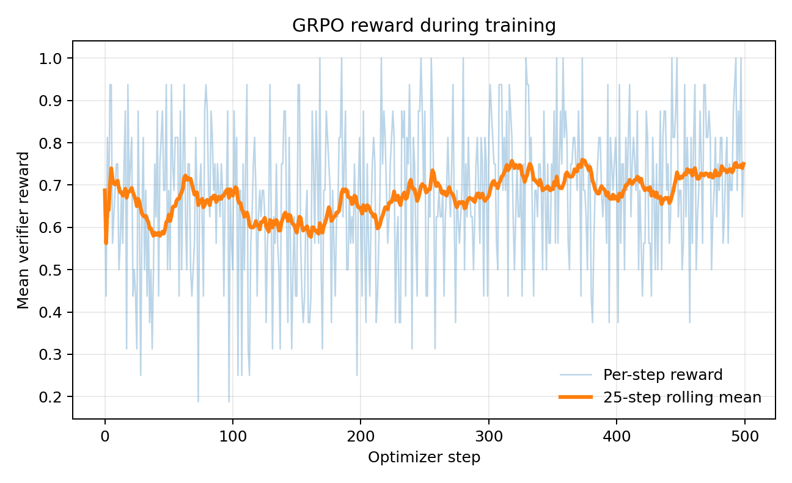
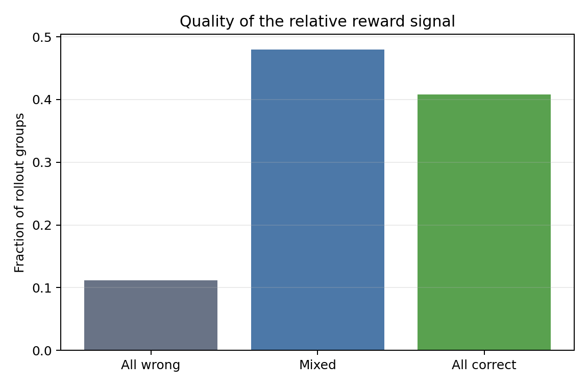
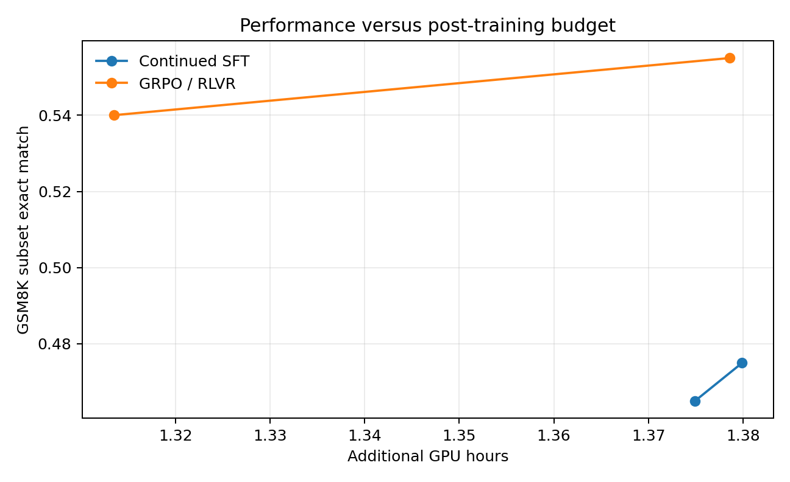

# Experimental Report

## Executive summary

This experiment asked whether verifier-guided GRPO is more effective than continued supervised fine-tuning when both branches receive the same additional GPU-time budget after a shared reasoning-SFT checkpoint.

The narrow answer is **yes on GSM8K**. GRPO reached 55.572% exact match, versus 48.446% for the compute-matched continued-SFT control: a paired improvement of **+7.127 percentage points** with a 95% bootstrap interval of **[+4.321, +10.083]** and exact McNemar p=2.52e-6. On SVAMP, GRPO led by **+5.333 points**, but the paired interval **[-0.333, +11.333]** includes zero.

The broader recipe did not beat the upstream model. Reasoning SFT sharply reduced accuracy from 66.945% to 47.915% on GSM8K and from 81.667% to 63.333% on SVAMP. GRPO recovered part of the lost capability, but remained below base. The supported claim is therefore that verifier-guided RL recovered more reasoning accuracy than equal-time continued SFT from this shared SFT checkpoint—not that post-training improved Qwen2.5-1.5B-Instruct overall.

## Frozen setup

| Item | Value |
|---|---|
| Base model | Qwen2.5-1.5B-Instruct |
| SFT / RL / validation split seed | 42 |
| SFT / RL / validation examples | 3,000 / 1,000 / 500 disjoint GSM8K-train rows |
| GRPO generations per prompt | 4 |
| Primary reward | Normalized exact-answer correctness, 0/1 |
| Primary evaluation | Greedy exact match |
| Benchmarks | GSM8K official test; SVAMP transfer |
| Git commit used for formal run | `69723360464bda8e9fab41d984361b850dc65330` |
| Working tree at launch | Clean |
| GPU | NVIDIA H100 80GB HBM3, one device |
| Python / PyTorch / CUDA | 3.12.3 / 2.8.0+cu128 / 12.8 |
| TRL / Transformers / PEFT | 1.11.0 / 5.16.1 / 0.20.0 |

The GRPO and continued-SFT branches loaded the same hashed `checkpoints/sft` source adapter. Their recorded source hashes are identical.

## Main held-out results

| Model | GSM8K exact match | GSM8K 95% CI | SVAMP exact match | SVAMP 95% CI | Extra GPU hours |
|---|---:|---:|---:|---:|---:|
| Base | **66.945%** | [64.443%, 69.371%] | **81.667%** | [77.333%, 85.667%] | — |
| Reasoning SFT | 47.915% | [45.262%, 50.720%] | 63.333% | [58.000%, 68.667%] | — |
| Continued SFT | 48.446% | [45.792%, 51.099%] | 58.667% | [53.000%, 64.333%] | 1.380 |
| GRPO / RLVR | **55.572%** | [52.767%, 58.302%] | **64.000%** | [58.667%, 69.333%] | 1.379 |

Full-benchmark sample sizes were 1,319 GSM8K examples and 300 SVAMP examples. Every checkpoint used the same prompt, greedy decoder, maximum generation length, answer parser, and verifier.

## Paired statistical comparisons

Because all checkpoints were evaluated on the same examples, paired differences are more informative than overlap between marginal confidence intervals. Intervals below use 10,000 deterministic paired bootstrap resamples.

| Comparison | Benchmark | Accuracy delta | Paired 95% CI | McNemar exact p |
|---|---|---:|---:|---:|
| SFT vs base | GSM8K | -19.030 pp | [-22.062, -15.921] | 2.76e-33 |
| SFT vs base | SVAMP | -18.333 pp | [-24.000, -12.333] | 5.01e-9 |
| GRPO vs base | GSM8K | -11.372 pp | [-14.329, -8.415] | 8.57e-14 |
| GRPO vs base | SVAMP | -17.667 pp | [-23.667, -11.667] | 6.07e-8 |
| GRPO vs SFT | GSM8K | +7.657 pp | [+5.080, +10.159] | 5.29e-9 |
| GRPO vs SFT | SVAMP | +0.667 pp | [-4.333, +5.333] | 0.894 |
| GRPO vs continued SFT | GSM8K | +7.127 pp | [+4.321, +10.083] | 2.52e-6 |
| GRPO vs continued SFT | SVAMP | +5.333 pp | [-0.333, +11.333] | 0.0929 |

On GSM8K, GRPO corrected 244 examples that continued SFT missed, while continued SFT corrected 150 examples that GRPO missed. On SVAMP, the corresponding counts were 48 and 32; the smaller benchmark does not provide enough evidence for a definitive transfer claim.

## Compute comparison

| Method | Extra GPU hours | Optimizer steps | Training tokens | Peak VRAM |
|---|---:|---:|---:|---:|
| Continued SFT | 1.380021 | 7,421 | 39,421,968 | 5.43 GB |
| GRPO / RLVR | 1.379438 | 500 | 1,849,983 | 7.45 GB |

The additional GPU-time mismatch was **0.0423%**. This supports calling the branches compute-matched in measured single-GPU wall time. It does not make them token-, step-, or FLOP-matched: supervised training processed about 21.3 times as many training tokens because it avoids online generation.

The initial SFT stage used 0.0688 GPU-hours, 376 optimizer steps, 1,995,640 training tokens, and 5.38 GB peak VRAM. Formal training, the eight main evaluations, and the four saved-checkpoint evaluations totalled approximately **3.611 recorded GPU-hours**. At the observed RunPod rate of $3.30/hour, that measured workload cost about **$11.91**, excluding setup, smoke tests, idle time, and storage.

## GRPO training dynamics

The mean verifier reward increased from **0.640** across the first 50 optimizer steps to **0.735** across the final 50. This is training reward, not held-out accuracy; it is reported only as evidence that online sampling changed over the run.

Across 8,000 sampled completions (2,000 four-completion groups):

| Reward-group type | Count | Fraction |
|---|---:|---:|
| All wrong | 224 | 11.2% |
| Mixed | 960 | 48.0% |
| All correct | 816 | 40.8% |

Mixed groups provide within-group relative advantage; 48.0% of groups supplied that direct signal. The remaining 52.0% had equal binary rewards within the group.

Mean completion length was 130.7 tokens. Correct completions averaged 117.0 tokens, while incorrect completions averaged 159.5. The verifier therefore did not simply reward longer responses; if anything, incorrect rollouts were substantially longer.

## Performance versus measured budget

The budget curve uses the fixed first 200 GSM8K test examples and only the final two retained checkpoints per branch:

| Branch | Checkpoint step | GSM8K diagnostic accuracy |
|---|---:|---:|
| Continued SFT | 7,400 | 46.5% |
| Continued SFT | 7,421 | 47.5% |
| GRPO | 475 | 54.0% |
| GRPO | 500 | 55.5% |

Both branches improved slightly over their final retained interval. This diagnostic is not substituted for the full 1,319-example GSM8K headline result.

## Manual failure analysis

Twenty deterministic SFT-versus-GRPO disagreements were reviewed using the raw generations.

| Category | Count | Representative IDs |
|---|---:|---|
| Successful corrected reasoning | 11 | `gsm8k-test-787`, `779`, `70`, `354`, `10` |
| RL-specific degeneration | 8 | `gsm8k-test-1287`, `290`, `275`, `227`, `1241` |
| Wrong strategy despite correct answer | 1 | `gsm8k-test-1310` |

Common successful corrections included preserving time constraints, applying all multipliers, and avoiding invented quantities. Common regressions included double counting, omitting a term from the requested total, reversing a cost adjustment, and confusing a unit rate.

The `gsm8k-test-1310` case is especially important: GRPO produced the correct final number through compensating reasoning errors. The exact-answer verifier awarded it as correct. This demonstrates that RLVR can optimize the verified endpoint without guaranteeing a valid reasoning trace.

The full reviewed sheet, with questions, both completions, categories, and notes, is stored in `results/analysis/failure_review.csv`.

## Interpretation

Three conclusions are supported:

1. **Verifier-guided GRPO was more effective than equal-time continued SFT on in-domain GSM8K after the shared SFT checkpoint.** The +7.127-point paired difference is both practically large and statistically clear in this run.
2. **Transfer evidence is suggestive, not conclusive.** GRPO led continued SFT by 5.333 points on SVAMP, but the 95% paired interval crosses zero.
3. **The initial SFT recipe was destructive relative to base.** GRPO recovered a meaningful fraction of the lost GSM8K accuracy but did not restore upstream performance. The project is therefore a study of recovery and compute allocation after SFT, not a successful end-to-end improvement over the base model.

## Limitations

- One 1.5B-parameter model, one training domain, and one primary seed.
- GPU-hours are a practical infrastructure measure, not hardware-independent FLOPs.
- Continued SFT used labeled reasoning solutions; GRPO used prompts and verifier feedback. Equal time does not equal equal information.
- The supervised branch reused a 3,000-example set for 7,421 optimizer steps, which likely contributed to overfitting.
- The base model already performed strongly, leaving limited headroom and making destructive SFT especially visible.
- Exact-match correctness cannot validate intermediate reasoning, as the manual review directly demonstrates.
- SVAMP contains only 300 evaluated examples, leaving the transfer comparison underpowered.
- Saved-checkpoint curves include only the last two retained checkpoints per branch.

## Reproducibility and artifact map

- Main summaries: `results/evaluation/{base,sft,continued_sft,grpo}_{gsm8k,svamp}.json`
- Raw example-level predictions: `generations/evaluation/*.jsonl`
- Paired statistics: `results/analysis/comparison_statistics.{json,md}`
- Compute accounting: `results/analysis/compute_table.md`
- Reward dynamics: `results/analysis/training_dynamics.json`
- Reviewed examples: `results/analysis/failure_review.csv`
- Frozen configs: `configs/*.yaml`
- Run provenance: `results/{sft,grpo,continued_sft}/run_metadata.json`

All reported headline numbers are derived from formal-run artifacts, never from smoke-test outputs.
